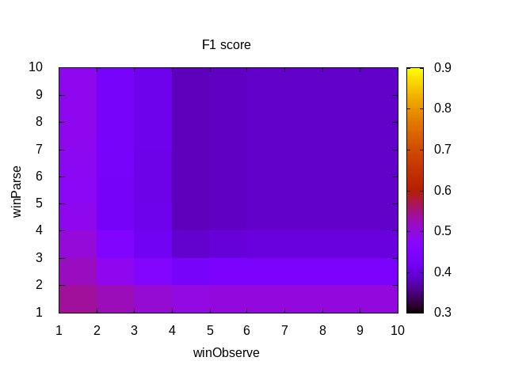
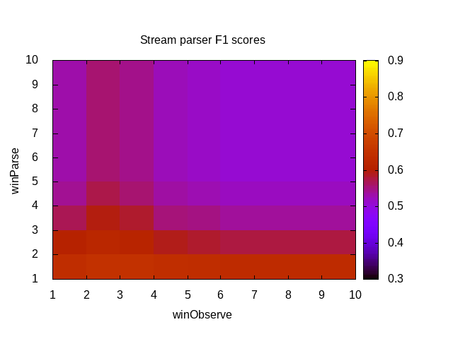

# Notes on processing rangram grammars and corpora

## Aug-2019; ASuMa

The current repo is an attempt to test different components of the ULL pipeline on a number of grammars.

First we use very simple hand-coded grammars as a sanity test to make sure the [ULL grammar
learner](https://github.com/singnet/language-learning) does what is required in a basic POC, perhaps similar to POC-Turtle and POC-English, but starting from a given grammar instead of arbitrary sentences. 
An advantage of generating a grammar this way is that we can get an arbitrary number of sentences from it, so building large lexical corpora from it is much easier than crafting them by hand.
Equally important, we also get a Gold Standard to evaluate the processing methods.

***************************

The first tested grammar [handgram1.grammar](data/handgram1.grammar) and consists of 6 grammatical classes
(2 related to nouns, 1 to verbs, 1 to adjectives, 1 to adverbs and 1 to determiners).
Each class has only one possible word and disjuncts are created having in mind the
English language rules; no Zipfian distributions are expected in the resulting corpus.

First corpora generated in workdir are of size 5, 10, 50, 100, 200, 500 and 1000 sentences.
For each corpus, only a subset of the sentences are unique. The following lists the nbr
of unique sentences per corpus size in this experiment:

ERRATA (Oct, 2019): This section was written when there was a bug in the corpus generator.
See Oct 24, 2019 entry for corrected numbers.
```
SIZE  	UNIQUE SENTS
5		5
10		10
50		28
100		48
200		68
500		75
1000		77
```
Increasing the size and repeating the random generation didn't increase the number of unique sentences.
We assume 77 is the number of possible sentences that the grammar allows.

****************************
## Sept-2019; ASuMa

Grammar Learner (GL) tests with simple handgram1.grammar and ILE were successful: grammar was learned perfectly (as evaluated by parse-evaluator F1 score) from the 5-sentence corpus. First proof of concept.
Running grammar-learner + parse-evaluator as
> language-learning/pipeline/ppln.py handgram1_5s_ILE.json

Results in 
> langauge-learning/output/handgram1/5sent/

***************************

GL ILE test with 77-sentence handgram1 corpus (77 unique sentences possible, obtained from 1000 sentence rangram corpus generator):

Running grammar-learner + parse-evaluator as
> language-learning/pipeline/ppln.py handgram1_77s_ILE.json

Results in 
> langauge-learning/output/handgram1/77s_ILE/

F1 score = 95.17%

The errors are all coming from the association of "red" and "the" with both "kids" and "turtle", which is probably a bad design of this grammar, and also the grammar generator doesn't create a perfect corpus for this. It creates parses like:

```
the kids eat turtles
1 the 4 turtles
2 kids 3 eat
3 eat 4 turtles
```

which are correct according to the grammar, but feel weird in English.

***************************

GL ILE test with 77-sentence handgram1 corpus:

Running grammar-learner + parse-evaluator as
> language-learning/pipeline/ppln.py handgram1_77s_ALE.json

Results in 
> langauge-learning/output/handgram1/77s_ALE/

F1 score = 97.4%

## Oct-2019; ASuMa

### Evaluating handgram1

The corpora generated by rangram can be processed with 5 different frameworks, all of which
can be evaluated by SingNet's parse-evaluator:

- Stream-parser (SP): https://github.com/glicerico/stream-parser
- OpenCog/SingNet's ULL pipeline parser (ULLP): https://github.com/singnet/learn/
- SingNet's Grammar Learner (GL): https://github.com/singnet/language-learning/
- SP + GL: Parsing with the grammar learned from parses by SP
- ULLP + GL: Parsing with the grammar learned from parses by ULLP

We use two baselines as a reference:
- random parses: a random planar tree that connects all words in the sentence (no crossings, no loops).
- sequential parses: each word in a sentence is simply connected to the next one.

For the SP, we currently explore two parameters: the size of the observation window for pair-counting (winObserve) and the size of the parsing window for parsing (winParse).
Currently, there is no implemented weighting related to distance for word-pairs counting.
By using the [stream_evaluate](https://github.com/glicerico/stream-parser/blob/master/src/scripts/stream_evaluate.sh) script, we can use a range of values for winObserve and winParse easily.

Guided by experiments performed with the [ULLP](https://docs.google.com/spreadsheets/d/1TPbtGrqZ7saUHhOIi5yYmQ9c-cvVlAGqY14ATMPVCq4/edit#gid=963717716) in other corpora, we focus our attention to its window-based method (win=6) with distance weight for calculating PMI, and no distance-weight when MST-parsing.
It's worth noting that the `ULL parser` includes a `###LEFT-WALL###` token, comparable to the `root` node in other grammar formalisms.
This token will be ignored in the evaluation, but it may affect the structure of the possible parses, as long as it links to anything other than the first word in a sentence.

For the GL, we experiment with both the ILE and ALE methods. The bulk of the parameters can be found in the respective json files of the experiments.

***************************

We first evaluate the complete handgram1 (77 sentences) with SP for winObserve and winParse up to 10.
The parse evaluation is done against the gold standard (GS) that rangram provides for the corpus.
The following colormap summarizes F1 scores: 


The scores obtained range from 38.12% to 56.27%, the higher ones corresponding to the lowest values of both parameters (highest value is for `winObserve=1`, `winParse=1`)
It's interesting to note that `winObserve=1` represents sequential parses, but given that the stream-parser only links words with `PMI>0`, the sequential parses may not be covering the complete sentence.

As a baseline for comparison, a full sequential parse scores 58.42%, while the average score for random parsing this corpus is 46.6%.
Stream-parser gets close to the sequential baseline, but cannot improve it.
This is expected, seeing that the highest score is coming from incomplete sequential parses.

Most importantly, this should be seen as an exercise to test the parsing and evaluation pipelines, not as an evaluation of their capabilities.
This is probably because such a limited grammar can hardly provide meaningful mutual information measures that could be leveraged by the parses that rely on these.

***************************

Processing handgram1 with the ULLP, we obtain the following f1-scores:
- win6-odist		54.54%
- LG-any			54.34%
- LG-24				56.31%
- win6-omdist(4321)	54.54%

***************************

Feeding the best results of SP to GL, we get:

- best SP + GL ALE: 56.92%
- best SP + GL ILE: 56.33%

In both cases, F1 score was slightly better than its input (56.27%)

***************************

Finally, feeding the best ULLP result to GL, we get:

- best ULLP + GL ALE: 54.4%
- best ULLP + GL ILE: 55.2%

In this cases, F1 is slightly worse than its input (56.31%).

***************************

In summary, the best result for each method are shown in the following table:

F1 score [%]

|        |Sequential|Random| SP  |ULLP |GL   |SP+GL|ULLP+GL|
|--------|----------|------|-----|-----|-----|-----|-------|
|handgram1|58.42     |46.6  |56.27|56.31|97.4 |56.92|55.2   |

Again, this should be seen as an exercise to test the parsing and evaluation pipelines, not as an evaluation of their capabilities.
This is probably because such a limited grammar can hardly provide meaningful mutual information measures that could be leveraged by the parses that rely on these.
************************************

## 24 Oct, 2019; ASuMa
A [bug in the sentence-generator code](https://github.com/glicerico/rangram/issues/11) 
had been noticed in the past (referred above).
It produced ungrammatical sentences, and thus affected all results above.
The description of the evaluation methods is still valid, only the numbers are incorrect.

Here's a summary of the re-evaluation of methods using handgram1.

************************************

First, it should be mentioned that the grammar handgram1.grammar was improved slightly after the experiments above.
In its current form, it allows for a maximum of 40 unique sentences, all of which are produced by the corpus generator when asked for 200 sentences.

F1 score [%]

|        |Sequential|Random| SP  |ULLP |GL  |SP+GL|ULLP+GL|
|--------|----------|------|-----|-----|----|-----|-------|
|handgram1|68.14     |52.0  |66.08|53.16|100 |     |       |

The results from the fixed corpus generator for `handgram1` are in general better than the past ones, but the relative performance of the methods didn't change greatly.
In particular, the best parsing result is still `sequential` parsing, closely followed by the `stream-parser`, when it produces almost-sequential parses.
However, the distribution of results from `stream-parser` did change slightly from the past one (image above).
Here's the corresponding image for this remake:



Interestingly, the results for the `ULL parser` decreased slightly.
The `grammar-learner`, on the other hand, achieved perfect score, and now produces the correct grammar;
now that the corpus is correctly generated from the grammar, GL can learn it right.
We didn't perform `SP+GL` or `ULLP+GL` experiments this time, expecting them to show a similar trend.
 
**************************************** 
### Evaluating handgram0
The parsers are not able to properly parse even handgram1, and they don't score above sequential parses.
As I created an even simpler grammar for debugging, [handgram0.grammar](data/handgram0.grammar), I run it through the automated tests.
The corpus from this grammar contains only 4 unique sentences, and its parses are almost sequential (except for a link from `the` and `kids` in the sentence `the red kids eat turtles`).
The results are:

F1 score [%]

|        |Sequential|Random| SP  |ULLP |GL   |SP+GL|ULLP+GL|
|--------|----------|------|-----|-----|-----|-----|-------|
|handgram0|93.75     |55.19|93.75|93.75|100  |     |   |

All the learned parses are sequential, and this score as good as that baseline.
The `grammar-learner` again learns the proper grammar, though.

****************************************

### Evaluating rangram1
We now proceed to process our first randomly-generated grammar: [rangram1.grammar](data/rangram1.grammar).
This grammar includes a small number of grammatical classes, and has a Zipfian distribution of words in the classes (the number of words in each class follows a power law).
The parameters used to generate `rangram1` are:
```
% Grammar parameters:
% num_words = 20
% num_classes = 4
% num_class_connectors = 7
% connectors_limit = 2
```

The corpus generated from it contains 4185 unique sentences, which is likely close to the total possible sentences for this grammar.
Processing with the different methods, we obtain the following results:

F1 score [%]

|        |Sequential|Random| SP  |ULLP |GL   |SP+GL|ULLP+GL|
|--------|----------|------|-----|-----|-----|-----|-------|
|rangram1|67.03     |54.05 |80.65|48.75|100  |     |       |

First thing to notice here is that the `sequential` parse result is surpassed for the first time.
The `stream-parser` manages to score better, and not only in one or two parameter combination: it actually beats the baseline in every case.
This tells us that `rangram1` is not very sequential (similar to `handgram1`), and that the `stream-parser` managed to leverage the mutual information between word-pairs.

In that sense, it's surprising that the `ULL parser` performed so poorly, even worse than `random`.
The `grammar-learner`, again, learns the grammar perfectly.

It's interesting to see how the size of the corpus made a big difference in the perfomance of the parsers, even in this grammar which includes only a few words per class.
This corpus contains all possible sentences (or almost) from this grammar.
It could be interesting to see how would the performance be with a fraction of the sentences.

Hence, we cut the size of the previous corpus and GS in half and run the processing again.
These are the obtained results (update: these results from fractions of rangram1 are biased, see repetition of the experiment below):


F1 score [%]

|        |Sequential|Random| SP  |ULLP |GL   |SP+GL|ULLP+GL|
|--------|----------|------|-----|-----|-----|-----|-------|
|rangram1_half|71.05  |56.51 |81.7|58.74|100  |     |       |

Again, cutting the corpus size to one quarter of the complete one, we get:

F1 score [%]

|        |Sequential|Random| SP  |ULLP |GL   |SP+GL|ULLP+GL|
|--------|----------|------|-----|-----|-----|-----|-------|
|rangram1_quarter|72.06     |57.61 |82.04|60.75|100  |     |       |

Given the trend, we can't but keep going. 
One tenth of the complete corpus gives:

F1 score [%]

|        |Sequential|Random| SP  |ULLP |GL   |SP+GL|ULLP+GL|
|--------|----------|------|-----|-----|-----|-----|-------|
|rangram1_tenth|71.03     |57.46 |76.15|62.31|100/98.85  |     |       |

There is a small fluctuation in every score, but the one that stands out is the `ULL parser` one, which increases more than 13% as we reduce the corpus size.
Taking a look at the ULL parses, we note that for the complete corpus, only one `###LEFT-WALL###` link is created per sentence (which is ignored during evaluation).
For the smaller corpora, up to 1.43 `###LEFT-WALL###` links are created per sentence (this number is for the `tenth` corpus).
The creation of such links is affecting the ULL parses positively, somehow, even if they are ignored during evaluation.

On the other hand, we notice that the `tenth` corpus is the first one that causes the GL to not learn the grammar perfectly, in its ALE form.

********************************************

A more elaborate grammar, [rangram2](data/rangram2.grammar) is created with the following parameters:

```
% Grammar parameters:
% num_words = 20
% num_classes = 8
% num_class_connectors = 20
% connectors_limit = 3
```
The number of classes, class connectors, and connectors_limit was increased from those of `rangram1`.
The corpus generated in this case contains 5735 sentences, which is way less than the maximum unique sentences that the grammar can generate.
In this case, the results are as follows:

F1 score [%]

|        |Sequential|Random| SP  |ULLP |GL   |SP+GL|ULLP+GL|
|--------|----------|------|-----|-----|-----|-----|-------|
|rangram2|52.49     |34.67 |54.78|55.31|75.08|     |       |

Since this is a very incomplete corpus, we test by doubling its size (it has to be regenerated, so it doesn't necessarily include the same sentences as the first corpus):

F1 score [%]

|        |Sequential|Random| SP  |ULLP |GL   |SP+GL|ULLP+GL|
|--------|----------|------|-----|-----|-----|-----|-------|
|rangram2_double|51.92|34.05 |54.43|55.15|74.38|     |       |

The results did not change much with double corpus size.

****************************

The question arises here as to why the `grammar-learner` fails to learn the grammar correctly.
To study this in an easier way, we proceed to create some other hand generated grammars that could shed light on this.
It is also possible that the sentence generator or the random grammars have some bug, and using hand-crafted ones may prove more asy to debug.

[handgram2](data/handgram2.grammar) has the same linking structure as handgram1, but it contains more words per category.
The complete corpus contains all possible 8520 sentences that can be generated from the grammar.
Results after processing are:

F1 score [%]

|        |Sequential|Random| SP  |ULLP |GL   |SP+GL|ULLP+GL|
|--------|----------|------|-----|-----|-----|-----|-------|
|handgram2|53.83|44.73 |53.22|36.83|100|     |       |

The scores are considerably lower than those of `handgram1`, except for the `grammar-learner`.
This implies that more vocabulary, or at least the vocabulary distribution assigned to this grammar, makes the complete corpus less sequential (probably by generating more samples of the sentence structures that are less sequential), and adds more noise to the word-pair mutual information.
The grammar-learner still performs perfectly.

The best `stream-parser` results, the closest to `sequential` are obtained with a `winParse=1`, so they are basically sequential as well.

**********************
For the sake of comparison, we run the evaluations on a tenth of the corpus:

F1 score [%]

|        |Sequential|Random| SP  |ULLP |GL   |SP+GL|ULLP+GL|
|--------|----------|------|-----|-----|-----|-----|-------|
|handgram2_tenth|63.88|51.77 |62.94|48.2|100|     |       |

The change in the sequential score is surprising, so we repeat the evaluation for a different tenth of the corpus

F1 score [%]

|        |Sequential|Random| SP  |ULLP |GL   |SP+GL|ULLP+GL|
|--------|----------|------|-----|-----|-----|-----|-------|
|handgram2_tenth2|45.91|37.48 |45.98|35.92|100|     |       |

These are clearly worse results.
This made me wonder why the top of the corpus (the first tenth) was more sequential than the last tenth of the corpus (`handgram_tenth2`).
The reason is that the mechanism for creating corpora in `corpus_generator.py` only writes a newly created sentence if it was not previously present in the corpus.
This causes that the sentences more likely to be produced (generally the simpler ones that don't require many recursions) are going to be positioned closer to the beginning of the file.
In contrast, longer, more convoluted sentences appear near the end of the corpus.

This invalidates the previous experiments done with `rangram1` when reducing the size of the corpus.
In order to do them properly, we need to randomize the order of the corpora and their respective gold standards.
An easy way to randomize the complexity of the sentences would be to order them alphabetically.
This way, we can also organize the gold standard in the same order.

*************************
After the above-mentioned randomization, here are the results of evaluation using the smaller `rangram1` corpora:

Half of `rangram1` F1 score [%]

|        |Sequential|Random| SP  |ULLP |GL   |SP+GL|ULLP+GL|
|--------|----------|------|-----|-----|-----|-----|-------|
|rangram1_half|66.82|53.0 |76.85|52.7|100|     |       |

Quarter of `rangram1` F1 score [%]

|        |Sequential|Random| SP  |ULLP |GL   |SP+GL|ULLP+GL|
|--------|----------|------|-----|-----|-----|-----|-------|
|rangram1_quarter|66.95|53.85|79.6|53.48|100|     |       |

Tenth of `rangram1` F1 score [%]

|        |Sequential|Random| SP  |ULLP |GL   |SP+GL|ULLP+GL|
|--------|----------|------|-----|-----|-----|-----|-------|
|rangram1_tenth|65.67|53.54 |77.48|54.04|100|     |       |

These results fluctuate in a much more expected way than the evaluations on the previously-biased subcorpora.
******************************

Coming back to the question of why the `grammar-learner` fails with `rangram2`, it seems like `handgram2` didn't shed much light on it, as the scores on GL are still 100%.
We create [handgram3](data/handgram3.grammar), which has a word distribution more similar to `rangram2`, where the classes with more connectors to other classes also have more  words.

We create a corpus with 13050 unique sentences, and obtain perfect grammar again:

F1 score [%]

|        |Sequential|Random| SP  |ULLP |GL   |SP+GL|ULLP+GL|
|--------|----------|------|-----|-----|-----|-----|-------|
|handgram3|50.16|41.16 |49.53|34.3|100|     |       |


