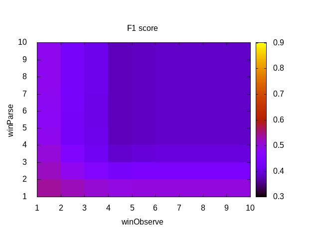
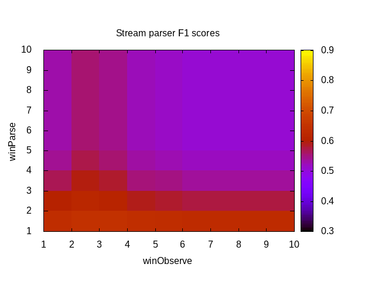

# Notes on processing rangram grammars and corpora

## Aug-2019; ASuMa

The current repo is an attempt to test different components of the ULL pipeline on a number of grammars.

First we use very simple hand-coded grammars as a sanity test to make sure the [ULL grammar
learner](https://github.com/singnet/language-learning) does what is required in a basic POC, perhaps similar to POC-Turtle and POC-English, but starting from a given grammar instead of arbitrary sentences. 
An advantage of generating a grammar this way is that we can get an arbitrary number of sentences from it, so building large lexical corpora from it is much easier than crafting them by hand.
Equally important, we also get a Gold Standard to evaluate the processing methods.

***************************

The first tested grammar [rangram0.grammar](data/rangram0.grammar) and consists of 6 grammatical classes
(2 related to nouns, 1 to verbs, 1 to adjectives, 1 to adverbs and 1 to determiners).
Each class has only one possible word and disjuncts are created having in mind the
English language rules; no Zipfian distributions are expected in the resulting corpus.

First corpora generated in workdir are of size 5, 10, 50, 100, 200, 500 and 1000 sentences.
For each corpus, only a subset of the sentences are unique. The following lists the nbr
of unique sentences per corpus size in this experiment:

ERRATA (Oct, 2019): This section was written when there was a bug in the corpus generator.
See Oct 24, 2019 entry for corrected numbers.
```
SIZE  	UNIQUE SENTS
5		5
10		10
50		28
100		48
200		68
500		75
1000		77
```
Increasing the size and repeating the random generation didn't increase the number of unique sentences.
We assume 77 is the number of possible sentences that the grammar allows.

****************************
## Sept-2019; ASuMa

Grammar Learner (GL) tests with simple rangram0.grammar and ILE were successful: grammar was learned perfectly (as evaluated by parse-evaluator F1 score) from the 5-sentence corpus. First proof of concept.
Running grammar-learner + parse-evaluator as
> language-learning/pipeline/ppln.py rangram0_5s_ILE.json

Results in 
> langauge-learning/output/rangram0/5sent/

***************************

GL ILE test with 77-sentence rangram0 corpus (77 unique sentences possible, obtained from 1000 sentence rangram corpus generator):

Running grammar-learner + parse-evaluator as
> language-learning/pipeline/ppln.py rangram0_77s_ILE.json

Results in 
> langauge-learning/output/rangram0/77s_ILE/

F1 score = 95.17%

The errors are all coming from the association of "red" and "the" with both "kids" and "turtle", which is probably a bad design of this grammar, and also the grammar generator doesn't create a perfect corpus for this. It creates parses like:

```
the kids eat turtles
1 the 4 turtles
2 kids 3 eat
3 eat 4 turtles
```

which are correct according to the grammar, but feel weird in English.

***************************

GL ILE test with 77-sentence rangram0 corpus:

Running grammar-learner + parse-evaluator as
> language-learning/pipeline/ppln.py rangram0_77s_ALE.json

Results in 
> langauge-learning/output/rangram0/77s_ALE/

F1 score = 97.4%

## Oct-2019; ASuMa

### Evaluating rangram0

The corpora generated by rangram can be processed with 5 different frameworks, all of which
can be evaluated by SingNet's parse-evaluator:

- Stream-parser (SP): https://github.com/glicerico/stream-parser
- OpenCog/SingNet's ULL pipeline parser (ULLP): https://github.com/singnet/learn/
- SingNet's Grammar Learner (GL): https://github.com/singnet/language-learning/
- SP + GL: Parsing with the grammar learned from parses by SP
- ULLP + GL: Parsing with the grammar learned from parses by ULLP

We use two baselines as a reference:
- random parses: a random planar tree that connects all words in the sentence (no crossings, no loops).
- sequential parses: each word in a sentence is simply connected to the next one.

For the SP, we currently explore two parameters: the size of the observation window for pair-counting (winObserve) and the size of the parsing window for parsing (winParse).
Currently, there is no implemented weighting related to distance for word-pairs counting.
By using the [stream_evaluate](https://github.com/glicerico/stream-parser/blob/master/src/scripts/stream_evaluate.sh) script, we can use a range of values for winObserve and winParse easily.

Guided by experiments performed with the [ULLP](https://docs.google.com/spreadsheets/d/1TPbtGrqZ7saUHhOIi5yYmQ9c-cvVlAGqY14ATMPVCq4/edit#gid=963717716) in other corpora, we focus our attention to its window-based method (win=6) with distance weight for calculating PMI, and no distance-weight when MST-parsing.

For the GL, we experiment with both the ILE and ALE methods. The bulk of the parameters can be found in the respective json files of the experiments.

***************************

We first evaluate the complete rangram0 (77 sentences) with SP for winObserve and winParse up to 10.
The parse evaluation is done against the gold standard (GS) that rangram provides for the corpus.
The following colormap summarizes F1 scores: 


The scores obtained range from 38.12% to 56.27%, the higher ones corresponding to the lowest values of both parameters (highest value is for `winObserve=1`, `winParse=1`)
It's interesting to note that `winObserve=1` represents sequential parses, but given that the stream-parser only links words with `PMI>0`, the sequential parses may not be covering the complete sentence.

As a baseline for comparison, a full sequential parse scores 58.42%, while the average score for random parsing this corpus is 46.6%.
Stream-parser gets close to the sequential baseline, but cannot improve it.
This is expected, seeing that the highest score is coming from incomplete sequential parses.

Most importantly, this should be seen as an exercise to test the parsing and evaluation pipelines, not as an evaluation of their capabilities.
This is probably because such a limited grammar can hardly provide meaningful mutual information measures that could be leveraged by the parses that rely on these.

***************************

Processing rangram0 with the ULLP, we obtain the following f1-scores:
- win6-odist		54.54%
- LG-any			54.34%
- LG-24				56.31%
- win6-omdist(4321)	54.54%

***************************

Feeding the best results of SP to GL, we get:

- best SP + GL ALE: 56.92%
- best SP + GL ILE: 56.33%

In both cases, F1 score was slightly better than its input (56.27%)

***************************

Finally, feeding the best ULLP result to GL, we get:

- best ULLP + GL ALE: 54.4%
- best ULLP + GL ILE: 55.2%

In this cases, F1 is slightly worse than its input (56.31%).

***************************

In summary, the best result for each method are shown in the following table:

F1 score [%]

|        |Sequential|Random| SP  |ULLP |GL   |SP+GL|ULLP+GL|
|--------|----------|------|-----|-----|-----|-----|-------|
|rangram0|58.42     |46.6  |56.27|56.31|97.4 |56.92|55.2   |

Again, this should be seen as an exercise to test the parsing and evaluation pipelines, not as an evaluation of their capabilities.
This is probably because such a limited grammar can hardly provide meaningful mutual information measures that could be leveraged by the parses that rely on these.
************************************

## 24 Oct, 2019; ASuMa
A [bug in the sentence-generator code](https://github.com/glicerico/rangram/issues/11) 
had been noticed in the past (referred above).
It produced ungrammatical sentences, and thus affected all results above.
The description of the evaluation methods is still valid, only the numbers are incorrect.

Here's a summary of the re-evaluation of methods using rangram0.

************************************

First, it should be mentioned that the grammar rangram0.grammar was improved slightly after the experiments above.
In its current form, it allows for a maximum of 40 unique sentences, all of which are produced by the corpus generator when asked for 200 sentences.

F1 score [%]

|        |Sequential|Random| SP  |ULLP |GL  |SP+GL|ULLP+GL|
|--------|----------|------|-----|-----|----|-----|-------|
|rangram0|68.14     |52.0  |66.08|53.16|100 |     |       |

The results from the fixed corpus generator for `rangram0` are in general better than the past ones, but the relative performance of the methods didn't change greatly.
In particular, the best parsing result is still `sequential` parsing, closely followed by the `stream-parser`, when it produces almost-sequential parses.
However, the distribution of results from `stream-parser` did change slightly from the past one (image above).
Here's the corresponding image for this remake:



Interestingly, the results for the `ULL parser` decreased slightly.
The `grammar-learner`, on the other hand, achieved perfect score, and now produces the correct grammar;
now that the corpus is correctly generated from the grammar, GL can learn it right.
We didn't perform `SP+GL` or `ULLP+GL` experiments this time, expecting them to show a similar trend.
 
**************************************** 
### Evaluating rangram-1 (read as "rangram negative 1")
The parsers are not able to properly parse even rangram0, and they don't score above sequential parses.
As I created an even simpler grammar for debugging, [rangram-1.grammar](data/rangram-1.grammar), I run it through the automated tests.
The corpus from this grammar contains only 4 unique sentences, and its parses are almost sequential (except for a link from `the` and `kids` in the sentence `the red kids eat turtles`).
The results are:

F1 score [%]

|        |Sequential|Random| SP  |ULLP |GL   |SP+GL|ULLP+GL|
|--------|----------|------|-----|-----|-----|-----|-------|
|rangram-1|93.75     |55.19|93.75|93.75|100  |     |   |

All the learned parses are sequential, and this score as good as that baseline.
The `grammar-learner` again learns the proper grammar, though.


